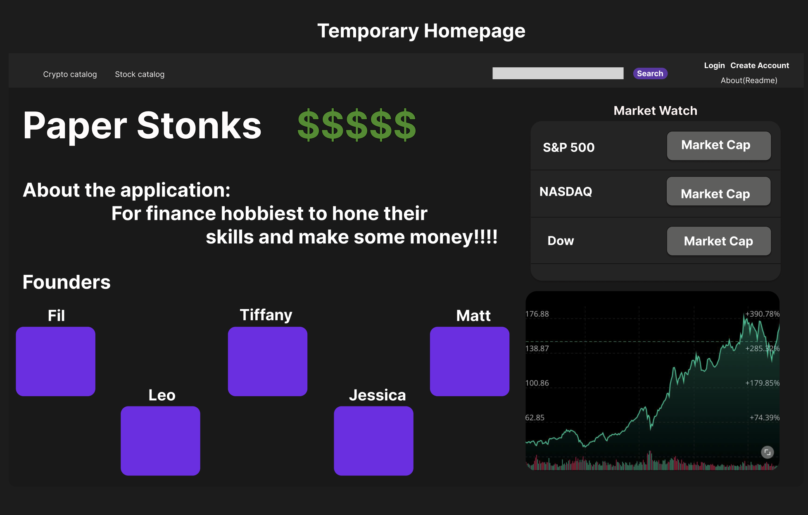
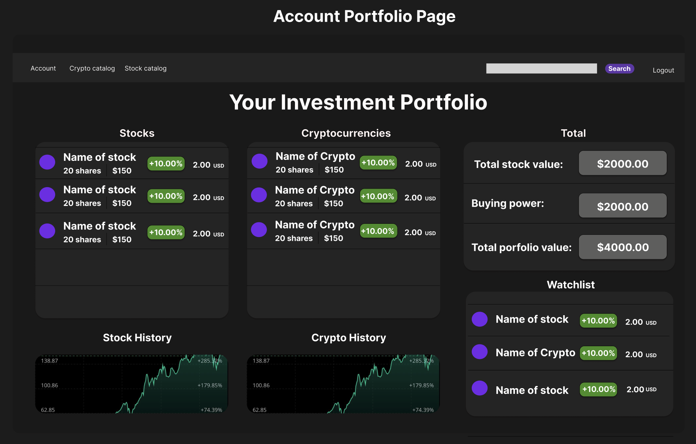
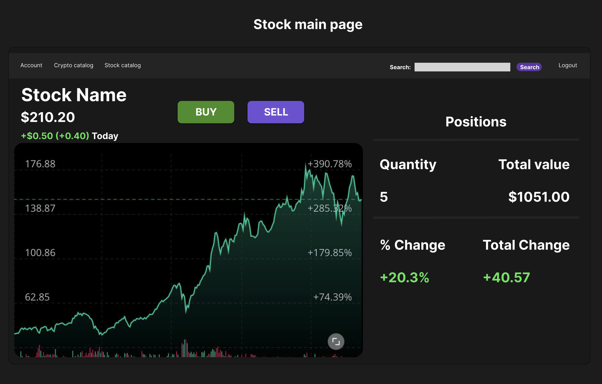
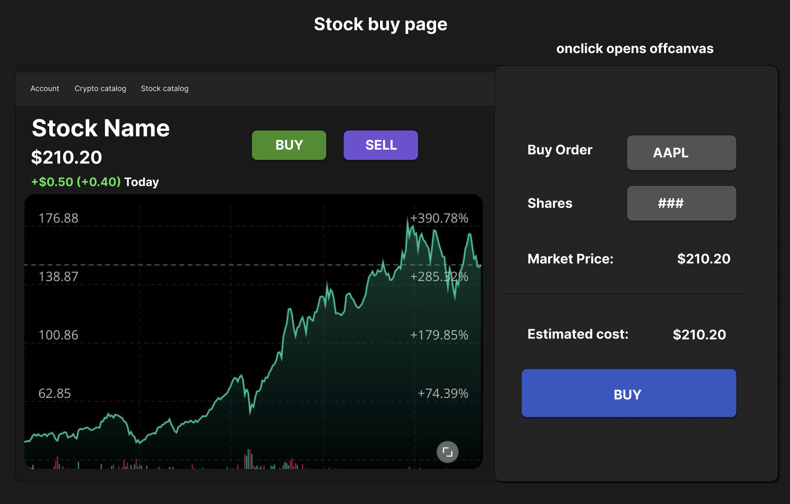
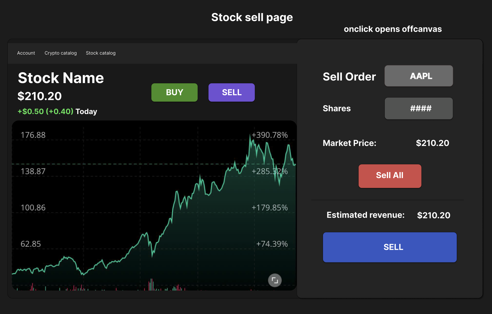

# Customer Graphical Human Interface

## Home Page

This is the first page a user will see when visiting the website. 
It will display information pertaining to the website.
There is a search bar to search for individual stocks.
There are links to login and sign up. 
All other pages will not be accessible unless the user has an account.

---

## Portfolio Page

Once logged in, the user can view their portfolio page. The user's positions will be displayed here along with their buying power and total investment value.

---

## Stock Page

When a user searches for a stock, they will be redirected to the stock's specific page. Here they will be able to see the price of the stock and can decided to buy a stock (a position). If they have already bought a stock, they can also sell their stock here.

---

## Stock Buy Page

On the stock main page, the user can buy a stock by clicking on the "BUY" button. A sidebar will then appear to allow the user to do so. 

---

## Stock Sell Page

On the stock main page, the user can sell a stock by clicking on the "Sell" button. A sidebar will then appear to allow the user to do so.

